

# Tactile Slip Detection from High-Bandwidth Tactile Sensing

Learning-based detection of incipient slip from piezoelectric tactile vibrations,
with robustness to manipulation perturbations and real-time performance.

  

### Publications

**AIM 2023 (published)**  
*Spectro-Temporal Recurrent Neural Network for Robotic Slip Detection with Piezoelectric Tactile Sensor*  
Théo Ayral, Saifeddine Aloui, Mathieu Grossard  
IEEE/ASME International Conference on Advanced Intelligent Mechatronics (AIM), 2023  
Seattle, USA

**CoDIT 2026 (submitted)**  
*Robust Tactile Slip Detection under Manipulation Perturbations*  
Théo Ayral, Saifeddine Aloui, Mathieu Grossard

### Main contributions

**C1 — Early slip detection from tactile vibrations**  
Detect **incipient slip** using a *piezoelectric tactile sensor* capturing friction-induced vibrations.  
Slip cues are extracted through **learning-based spectro-temporal analysis** and classified in **real time (100 Hz)** with short reaction delay.

**C2 — Data-driven robustness to perturbations**  
Improve robustness to transient events and actuation noise through **perturbation-aware training**.  
This significantly reduces **false alarms** (robustness: 38.77 % → 90.43 %) while preserving **perfect recall** on slip events and **low detection latency** (24.1 ms average).

➡️ This work is part of the PhD thesis  
**Learning-based slip detection for adaptive grasp control**  
CEA (Leti & List) · Université Paris-Saclay

## Context project

  

    <a href="https://thayral.github.io/PhD-manipulation/" style="text-decoration:none; color:inherit;">
      <video autoplay loop muted playsinline style="width:100%; height:auto; display:block;">
        <source src="media/tracebot-process.mp4" type="video/mp4">
      </video>

      

      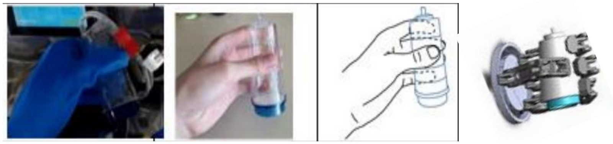
    </a>

    

      

        <strong>TraceBot use-case & platform context</strong> 
        <a href="https://thayral.github.io/PhD-manipulation/" style="color:#444; text-decoration:underline;">
          Learn more on my PhD page (setup, sensors, demos)
        </a>
      

      
    

  

Slip.gif

Slip detection must be early, reliable, and robust to perturbations.
While slip generates characteristic high-frequency tactile dynamics, real manipulation introduces many slip-like events (actuation noise, force transients) that can cause false alarms.

## Core method

### Spectro-temporal features (PzE → FFT/PSD → Spectrogram)

  <video autoplay loop muted playsinline style="width:33%; height:auto; display:block; margin: 0 auto;">
    <source src="media/fft_pze.mp4" type="video/mp4">
  </video>

  

  <video autoplay loop muted playsinline style="width:20%; height:auto; display:block; margin: 0 auto;">
    <source src="media/fft_frames.mp4" type="video/mp4">
  </video>

  

  <video autoplay loop muted playsinline style="width:33%; height:auto; display:block; margin: 0 auto;">
    <source src="media/fft_spectro.mp4" type="video/mp4">
  </video>

<em>We process high-bandwidth PzE tactile signals in short windows, extract frequency-domain PSD features via FFT, and build a spectrogram for slip classification.</em>

<table style="width:100%;">
  <tr>
    <!-- LEFT: big image -->
    <td width="50%" valign="middle" align="center">
      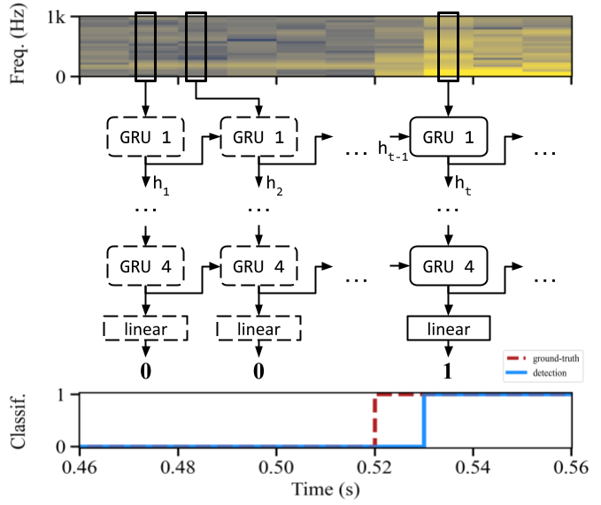
    </td>

    <!-- RIGHT: smaller image + bullets below -->
    <td width="50%" valign="top" align="center">
      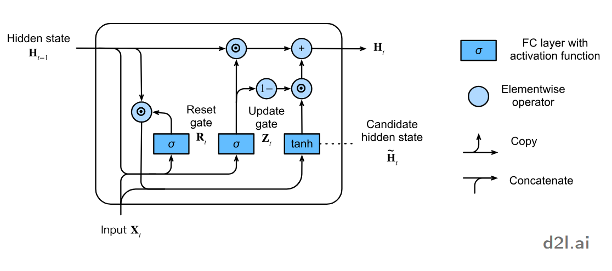

      

      

        <ul>
          <li>Identify <strong>spectral patterns</strong> of friction</li>
          <li>Analyse <strong>temporal evolution</strong> with recurrence</li>
          <li><strong>100Hz classification</strong> with binary classes</li>
          <li><strong>Training</strong> with binary cross-entropy (BCE)</li>
        </ul>
      

    </td>
  </tr>
</table>

## Dataset 1 — Controlled slip characterization

To study the **intrinsic tactile signature of slip** under controlled conditions, we first collect data on a dedicated characterization bench.  
The goal is to validate the **representation, architecture, and detection latency**, independently of manipulation complexity.

### Characterization bench

  <!-- keep total narrow -->
  

    

      <video autoplay loop muted playsinline style="width:50%; height:auto; display:block;">
        <source src="media/collect_animation.mp4" type="video/mp4">
      </video>

      <video autoplay loop muted playsinline style="width:50%; height:auto; display:block;">
        <source src="media/collect_signal.mp4" type="video/mp4">
      </video>
    

  

- Piezoelectric tactile sensor mounted on a **flat surface**
- A robotic probe applies a **controlled normal force**
- Slip is generated through **programmed sliding motions**
- Slip onset timing is obtained from **ground-truth probe position**

### Dataset generation

  

    <video autoplay loop muted playsinline style="width:100%; height:auto; display:block;">
      <source src="media/collect_mosaic.mp4" type="video/mp4">
    </video>
  

Slip trajectories are **randomly parametrized** to cover a wide range of contact conditions:

- Normal force: **2–10 N**
- Sliding distance: **10–32 mm**
- Sliding speed: **200–2000 mm/min**
- Typical slip duration: **≈ 1.5 s**

**Dataset size:** 3,200 recordings

### Detection performance (controlled conditions)

  

    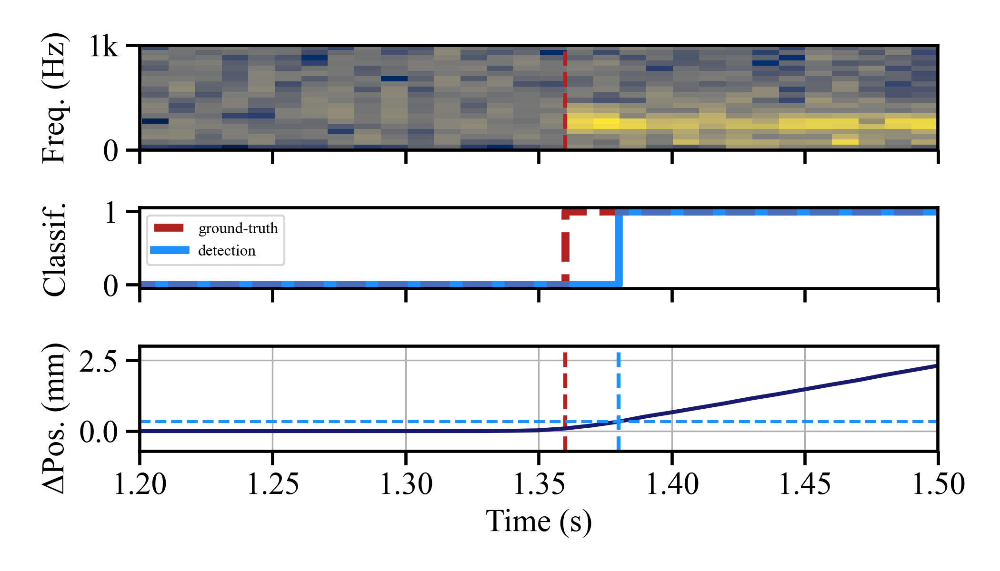
  

On this controlled dataset, the FFT–GRU model achieves:

- **Accuracy:** 98.73%
- **F1-score:** 0.9787
- **Average detection delay:** **8.5 ms**

These results demonstrate that **high-bandwidth tactile vibrations contain sufficient information for early slip detection**, and that the proposed spectro-temporal model can exploit them in real time.

<em>This controlled benchmark establishes a reference point for detection performance before addressing robustness under manipulation-induced perturbations.</em>

---

## From controlled slip to embodied perturbations

While the characterization bench provides **clean ground truth** and controlled slip trajectories, real robotic manipulation introduces additional sources of tactile dynamics that are **not related to slip**.

During grasping and manipulation, tactile sensors are exposed to:
- actuation-induced vibrations,
- transient force variations,
- contact reconfigurations and load changes,

all of which can produce vibration patterns that resemble slip at the signal level.

As a result, models trained only on controlled slip data may exhibit **false alarms** when deployed on a robot, despite performing well on idealized benchmarks.

To address this gap, we move from controlled tactile characterization to **embodied data collection under manipulation**, and explicitly model non-slip perturbations during training.

---

## Manipulation perturbations and false slip cues

During manipulation, tactile signals are affected by multiple sources of perturbations.
Some are **transient**, others **persistent**, and they can originate either from the **environment** or from the **robot itself**.
These events often produce vibration patterns that resemble slip, leading to false alarms if not properly modeled.

<table style="width:100%; border-collapse:collapse;">
  
  <!-- ===== TRANSIENT ===== -->
  <tr>
    <td width="18%" valign="top" style="padding:8px;">
      <strong>Transient perturbations</strong>
      <ul style="margin:6px 0 0 16px;">
        <li>Short, impulsive events</li>
        <li>Broadband vibration spikes</li>
      </ul>
    </td>

    <td width="26%" valign="middle" align="center" style="padding:8px;">
      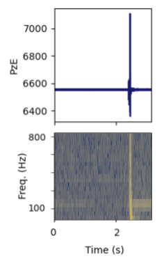
    </td>

    <td width="28%" valign="middle" align="center" style="padding:8px;">
      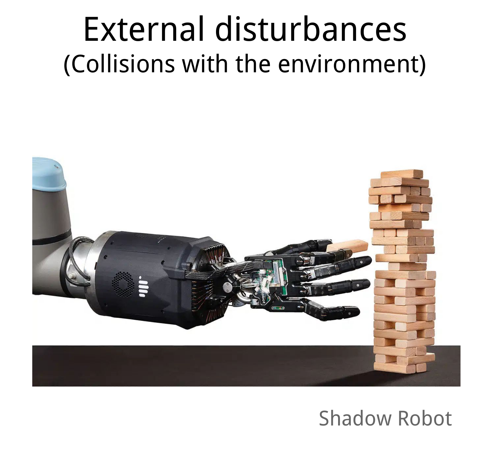
      

        External disturbance 
        <em>(environmental contact)</em>
      

    </td>

    <td width="28%" valign="middle" align="center" style="padding:8px;">
      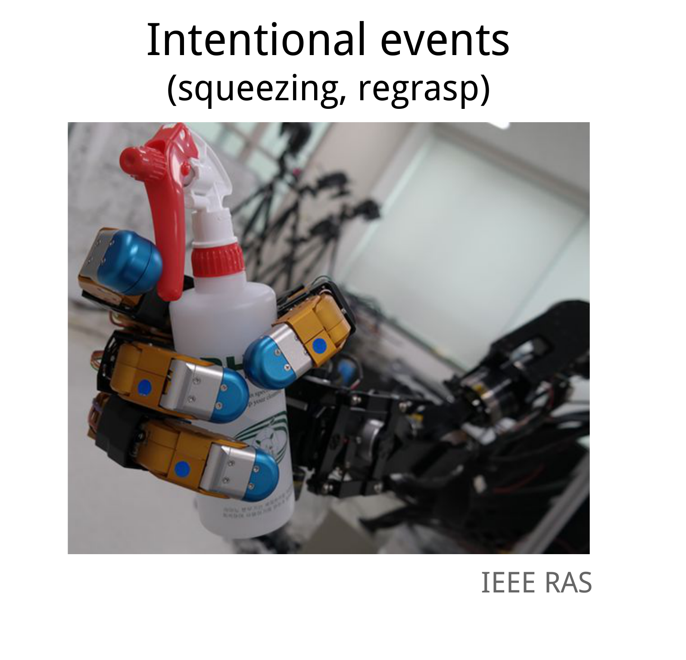
      

        Intentional action 
        <em>(regrasp, squeezing)</em>
      

    </td>
  </tr>

  <!-- ===== AMBIENT ===== -->
  <tr>
    <td width="18%" valign="top" style="padding:8px;">
      <strong>Ambient perturbations</strong>
      <ul style="margin:6px 0 0 16px;">
        <li>Persistent vibrations</li>
        <li>Narrow-band spectral content</li>
      </ul>
    </td>

    <td width="26%" valign="middle" align="center" style="padding:8px;">
      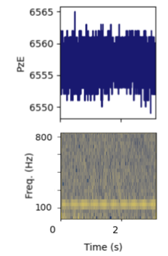
    </td>

    <td width="28%" valign="middle" align="center" style="padding:8px;">
      
      

        Environmental vibration 
        <em>(tool, surface)</em>
      

    </td>

    <td width="28%" valign="middle" align="center" style="padding:8px;">
      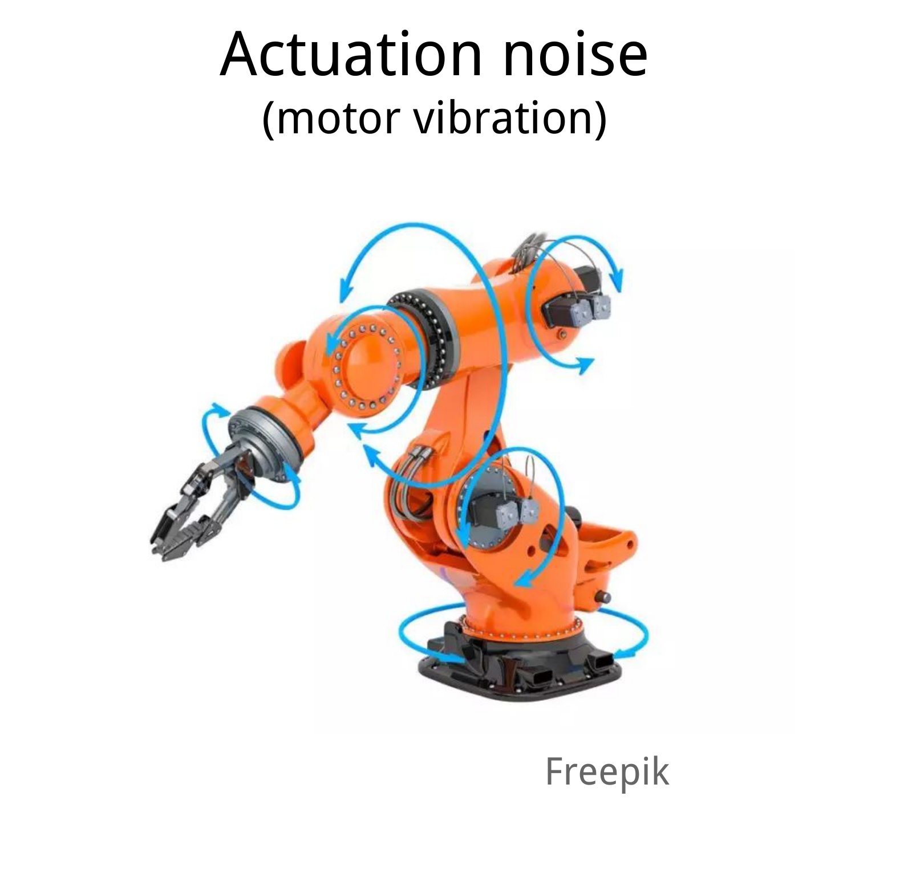
      

        Actuation noise 
        <em>(motor vibration)</em>
      

    </td>
  </tr>

</table>

<em>
These perturbations motivate explicit modeling and supervision strategies to distinguish true slip from slip-like tactile events during manipulation.
</em>

To evaluate slip detection under **real manipulation conditions**, we collect a second dataset directly on a robotic gripper.  
This dataset captures both **true slip events** and **non-slip perturbations** that arise during grasping and interaction.

The objective is to assess and improve the **robustness** of slip detection when tactile sensing is embedded in a closed-loop robotic system.

### Robotic data collection bench

  

    <video autoplay loop muted playsinline style="width:100%; height:auto; display:block;">
      <source src="media/bench_collect_nano.mp4" type="video/mp4">
    </video>
  

- Multi-fingered robotic gripper instrumented with hybrid tactile sensing
- Objects grasped under varying conditions
- Slip events generated by the external bench
- Additional tactile dynamics arise from **actuation, force modulation, and contact changes**

Ground truth labels distinguish **slip** from **non-slip perturbations**, enabling targeted supervision.

### Perturbation modeling

    
<table style="width:100%; border-collapse:collapse; margin:16px 0;">
  <tr>
    <!-- Left: image -->
    <td width="38%" valign="middle" align="center" style="padding:8px;">
      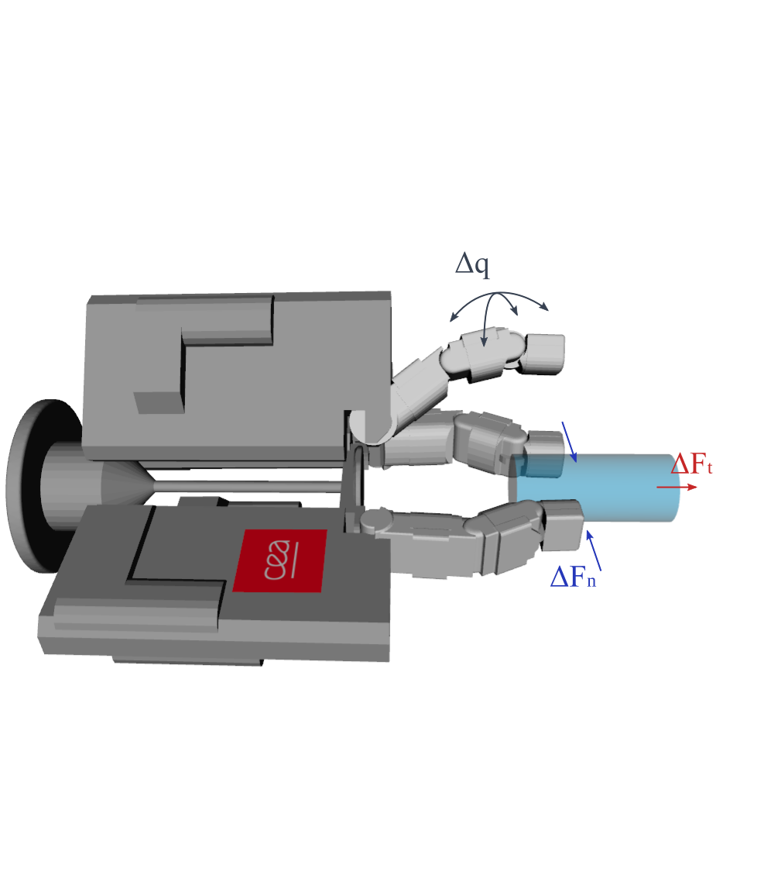
    </td>

    <!-- Right: text -->
    <td width="62%" valign="top" style="padding:8px;">

     During manipulation, several classes of perturbations are explicitly introduced:
     
      <ul style="margin:10px 0 0 18px;">
        <li><strong>Δq — Actuation noise:</strong> vibrations induced by finger motion and tendon actuation</li>
        <li><strong>ΔFn — Grasp effort variations:</strong> transient changes in normal force</li>
        <li><strong>ΔFt — External load variations:</strong> tangential forces applied to the grasped object</li>
      </ul>

      These events can generate tactile responses that resemble slip, and must be modeled during training to reduce false alarms.
    </td>
  </tr>
</table>

### Learning from perturbations

To reduce false slip detections under manipulation, we introduce **perturbation-aware supervision** during training.

Rather than treating all non-slip samples equally, we distinguish between:
- **clean no-slip** segments, and
- **non-slip perturbations** that generate slip-like tactile dynamics.

This enables the model to learn *what should be ignored* during manipulation, without sacrificing early slip sensitivity.

#### Supervision strategies

Perturbations are rare and short events, underrepresented in the data. We adopt targeted learning strategies.

  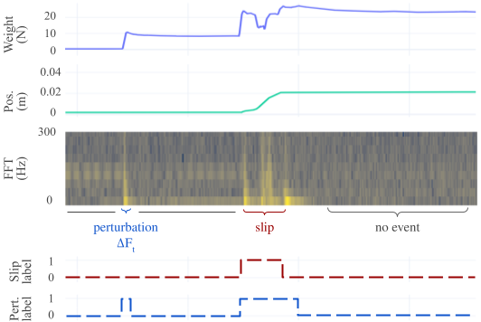

  

    Perturbation-weighted loss (ω)
  

  \[
  \mathcal L_w = - \frac{1}{\sum_t \omega_t} \sum_t \omega_t \log p_t^\star
  \]

  When perturbation time labels are available, training samples are reweighted to balance slip, clean no-slip, and perturbation events.  
  This explicitly penalizes false alarms caused by actuation noise and force transients.

  

    Focal loss (γ)
  

  \[
  \mathcal L_{\mathrm{focal}} = -\frac{1}{N}\sum_t (1-p_t^\star)^{\gamma}\log p_t^\star
  \]

 
  As an alternative that does not require perturbation labels, focal loss emphasizes difficult predictions by down-weighting easy examples.  
  This provides a label-free robustness mechanism, a lower-cost alternative.

  

    Haptic data fusion  (tactile + proprioception
  

  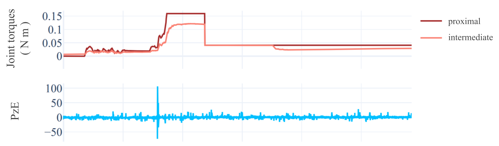

 
The model's spectrogram input is complemented with the proprioceptive signal of joint torques, estimated from the motor currents (through backdrivability). This enables better disambiguation of intentional events and true slip signal.

These strategies allow the same FFT–GRU architecture to transition from controlled slip detection to **robust embodied perception**.

### Robustness via targeted supervision

Using this dataset, we explore supervision strategies that explicitly incorporate perturbation information during training, while preserving real-time operation.

  

    <table style="width:100%; border-collapse:collapse;">
      <thead>
        <tr>
          <th align="left">Model</th>
          <th align="right">Delay (ms)</th>
          <th align="right">Clean F1</th>
          <th align="right">Δq</th>
          <th align="right">ΔFn</th>
          <th align="right">ΔFt</th>
        </tr>
      </thead>
      <tbody>
        <tr>
          <td>FFT–GRU <em>baseline</em></td>
          <td align="right">17.8 ± 9.5</td>
          <td align="right">1.000</td>
          <td align="right">52.8</td>
          <td align="right">43.9</td>
          <td align="right">19.6</td>
        </tr>
        <tr>
          <td>FFT–GRU <em>focal</em> (γ = 2)</td>
          <td align="right">25.3 ± 21.2</td>
          <td align="right">0.998</td>
          <td align="right">65.0</td>
          <td align="right">50.7</td>
          <td align="right">36.8</td>
        </tr>
        <tr>
          <td>FFT–GRU <em>weighted</em> (ω)</td>
          <td align="right">22.5 ± 16.2</td>
          <td align="right">1.000</td>
          <td align="right"><strong>96.8</strong></td>
          <td align="right">56.7</td>
          <td align="right"><strong>97.0</strong></td>
        </tr>
        <tr>
          <td>FFT–GRU <em>haptic</em> (ω + τ)</td>
          <td align="right">24.1 ± 18.0</td>
          <td align="right">1.000</td>
          <td align="right"><strong>96.8</strong></td>
          <td align="right"><strong>79.4</strong></td>
          <td align="right">95.1</td>
        </tr>
      </tbody>
    </table>
  

**Key observations**
- **Targeted weighting** significantly improves robustness under Δq and ΔFt (≈ 97% specificity)
- **Focal loss** offers a label-free alternative, but with reduced robustness
- **Haptic-aware supervision** improves resistance to grasp-force variations (ΔFn)

<em>This embodied dataset bridges the gap between controlled tactile characterization and real robotic deployment, enabling slip detection that remains reliable under manipulation-induced perturbations.</em>

### Robustness via targeted supervision (FFT–GRU)

  

  

    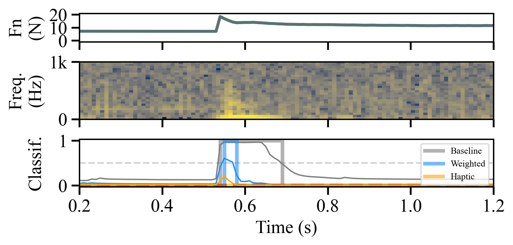
    

      Robust slip detection under grasp force variations (ΔFn).
    

  

  

    <table style="width:100%; border-collapse:collapse;">
      <thead>
        <tr>
          <th align="left">Model</th>
          <th align="right">Delay (ms)</th>
          <th align="right">Clean F1</th>
          <th align="right">Δq</th>
          <th align="right">ΔFn</th>
          <th align="right">ΔFt</th>
        </tr>
      </thead>
      <tbody>
        <tr>
          <td>FFT–GRU <em>baseline</em></td>
          <td align="right">17.8 ± 9.5</td>
          <td align="right">1.000</td>
          <td align="right">52.8</td>
          <td align="right">43.9</td>
          <td align="right">19.6</td>
        </tr>
        <tr>
          <td>FFT–GRU <em>focal</em> (γ = 2)</td>
          <td align="right">25.3 ± 21.2</td>
          <td align="right">0.998</td>
          <td align="right">65.0</td>
          <td align="right">50.7</td>
          <td align="right">36.8</td>
        </tr>
        <tr>
          <td>FFT–GRU <em>weighted</em> (ω)</td>
          <td align="right">22.5 ± 16.2</td>
          <td align="right">1.000</td>
          <td align="right"><strong>96.8</strong></td>
          <td align="right">56.7</td>
          <td align="right"><strong>97.0</strong></td>
        </tr>
        <tr>
          <td>FFT–GRU <em>haptic</em> (ω + τ)</td>
          <td align="right">24.1 ± 18.0</td>
          <td align="right">1.000</td>
          <td align="right"><strong>96.8</strong></td>
          <td align="right"><strong>79.4</strong></td>
          <td align="right">95.1</td>
        </tr>
      </tbody>
    </table>
  

  

  <ul>
    <li><strong>Weighting</strong> improves robustness under Δq / ΔFt (specificity ≈ 97%).</li>
    <li><strong>Focal loss</strong> is a lower-performing alternative without perturbation labels.</li>
    <li><strong>Haptic data</strong> improves robustness under ΔFn (up to <strong>79.4%</strong>).</li>
  </ul>

