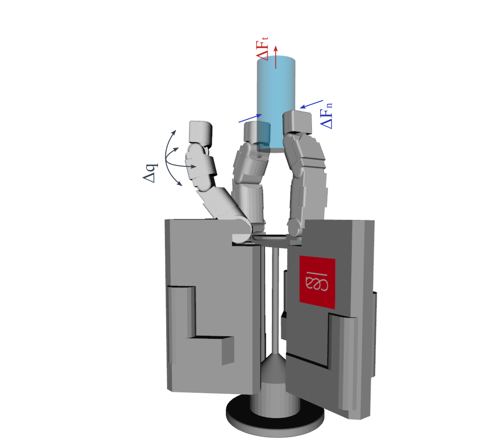

# Tactile Slip Detection from High-Bandwidth Tactile Sensing

Learning-based detection of incipient slip from piezoelectric tactile vibrations,
with robustness to manipulation perturbations and real-time performance.

  

### Publications

**AIM 2023 (published)**  
*Spectro-Temporal Recurrent Neural Network for Robotic Slip Detection with Piezoelectric Tactile Sensor*  
Théo Ayral, Saifeddine Aloui, Mathieu Grossard  
IEEE/ASME International Conference on Advanced Intelligent Mechatronics (AIM), 2023  
Seattle, USA

**CoDIT 2026 (submitted)**  
*Robust Tactile Slip Detection under Manipulation Perturbations*  
Théo Ayral, Saifeddine Aloui, Mathieu Grossard

### Main contributions

**C1 — Early slip detection from tactile vibrations**  
Detect **incipient slip** using a *piezoelectric tactile sensor* capturing friction-induced vibrations.  
Slip cues are extracted through **learning-based spectro-temporal analysis** and classified in **real time (100 Hz)** with short reaction delay.

**C2 — Data-driven robustness to perturbations**  
Improve robustness to transient events and actuation noise through **perturbation-aware training**.  
This significantly reduces **false alarms** (robustness: 38.77 % → 90.43 %) while preserving **perfect recall** on slip events and **low detection latency** (24.1 ms average).

➡️ This work is part of the PhD thesis  
**Learning-based slip detection for adaptive grasp control**  
CEA (Leti & List) · Université Paris-Saclay

### Spectro-temporal features (PzE → FFT/PSD → Spectrogram)

  <video autoplay loop muted playsinline style="width:33%; height:auto; display:block; margin: 0 auto;">
    <source src="media/fft_pze.mp4" type="video/mp4">
  </video>

  

  <video autoplay loop muted playsinline style="width:20%; height:auto; display:block; margin: 0 auto;">
    <source src="media/fft_frames.mp4" type="video/mp4">
  </video>

  

  <video autoplay loop muted playsinline style="width:33%; height:auto; display:block; margin: 0 auto;">
    <source src="media/fft_spectro.mp4" type="video/mp4">
  </video>

<em>We process high-bandwidth PzE tactile signals in short windows, extract frequency-domain PSD features via FFT, and build a spectrogram for slip classification.</em>

<table style="width:100%;">
  <tr>
    <!-- LEFT: big image -->
    <td width="50%" valign="middle" align="center">
      
    </td>

    <!-- RIGHT: smaller image + bullets below -->
    <td width="50%" valign="top" align="center">
      

      

      

        <ul>
          <li>Identify <strong>spectral patterns</strong> of friction</li>
          <li>Analyse <strong>temporal evolution</strong> with recurrence</li>
          <li><strong>100Hz classification</strong> with binary classes</li>
          <li><strong>Training</strong> with binary cross-entropy (BCE)</li>
        </ul>
      

    </td>
  </tr>
</table>

## Generating perturbations for training {#perturbations}

<table>
  <tr>
    <td width="55%" valign="top">
      <strong>Perturbation taxonomy</strong>
      <ul>
        <li><strong>ΔFn</strong> — Grasp effort variations: normal force (tighten / release)</li>
        <li><strong>ΔFt</strong> — External load variations: tangential load (shear / traction)</li>
        <li><strong>Δq</strong> — Actuation noise: structural vibrations</li>
      </ul>
      <em>Goal: reduce false alarms while preserving sensitivity to real slip.</em>
    <td width="45%" align="center" valign="top">
      
    </td>
  </tr>
</table>

  

# BENCH RSC NANO image + signals
# BENCH LOOP

setuplab.png
forFig6-start_31956.png

### Automated data collection bench
We rely on automated and parameterized benches to generate labeled slip events under controlled variability (object, speed, force, grasps) and to collect **non-slip perturbations** that mimic slip-like dynamics.

<!-- TEMPLATE: GIF for bench -->

  

<em>Automated bench for slip trajectory generation with ground-truth signals.</em>

## PERTURB TAXO TRANSIENT AMBIENT
## - > robust how ?
# VISU ROBUST delta FN + ROB ACC

## GIF CAROU + SIGNALS -> timing labels

## GIF MULTI MOSAIC + DATASET FACTS
## VISU CCL IMAGE RESULTS DELAY + ACC

### visu

exp_20240312_191525_run_20240312_191700_1757_noslip_run_torques_tau_merge_reel_rsc_fn.png
